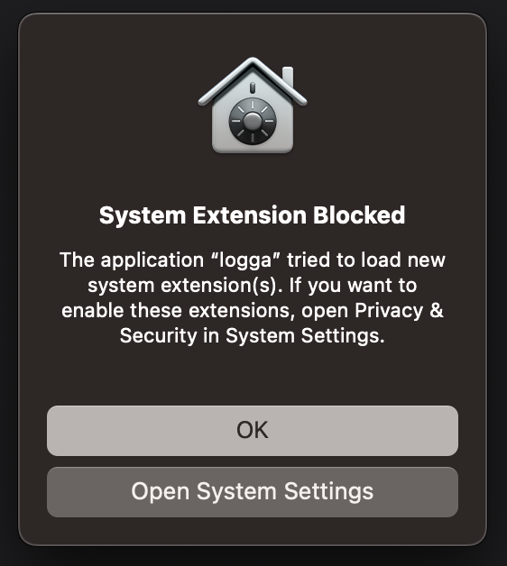

# Endpoint Security vulnerabilities and bugs

::: info
Before publishing, the logga team reported all of these findings (and possible exploits) to Apple. They did not deem any of them dangerous, but we will showcase the opposite.
:::

## 1. Bypassing the SystemExtension user consent prompt

The Endpoint Security framework is a special, "protected" library, as it gives access to sensitive system information. In order to be able to use it in an application, first the developer needs to request access from Apple. Then, the application must be packaged as a System Extension application: the Endpoint Security binary itself, plus an accompanying GUI application whose sole purpose is to load the Endpoint Security binary. The user is presented with a Consent Prompt as soon as the Endpoint Security binary is loaded.



It happens for a reason: the application cannot and should not load a sensitive library without the user knowing it. Imagine if (for example) the Spotify app would collect file access information from your system without you knowing it.

Technically, packaging an application as a System Extension is not the only way of running an Endpoint Security-included binary.
One can create a simple Command Line application (that uses ES) and package it as a GUI macOS application. When invoked, the application shows **NO** Consent Prompt. The only caveat is that the invoking process must have Full Disk Access. The bad news is that most developers with a MacBook have Full Disk Access enabled for either Terminal.app, iTerm, or sshd-keygen-wrapper, etc. There are multiple ways (supply chain attacks) to run our malicious application (without user consent) invoked by some of the FDA-enabled applications.

Apple dismissed our concern pointing to the Full Disk Access requirement. Dear developer, it is time to check your FDA settings 👀.

::: info
Disclaimer: We think @theevilbit also mentions this problem in his 2022 [talk](https://theevilbit.github.io/talks_workshops/2022/OBTS2022-Fitzl-The-Achilles-heel-of-EndpointSecurity.pdf).
:::

## 2. Bypassing the SystemExtension user consent prompt #2

This finding is really similar to the previous one. This time the malicious application will be invoked by a LaunchDaemon, and the application needs to have Full Disk Access.
Picture this:
- We create a fully innocent, useful application to gain user trust.  
- Many people install our app, and it becomes generally accepted as a trustworthy application.
- One day (probably after a new release), our app asks for Full Disk Access, but users don't suspect anything: they have been using it for some time now.
- With the next release, we release a pkg that installs the malicious binary & loads a LaunchDaemon.
- The user has no idea what just happened. (They may see the Login item notification)

## 3. Modifying TCC.db entry for invoking process

::: info
Transparency, Consent, and Control is a macOS mechanism to limit application access to other applications or system features (such as Full Disk Access).
:::

We do something really similar to point 1: invoke an Endpoint Security binary by a process that has FDA enabled. Let's say we invoke logga-daemon from the Terminal.app (that has FDA enabled).  

### TCC.db before invocation:
```
kTCCServiceSystemPolicyAllFiles|com.apple.Terminal|0|2|4|1|��
                                                               ||0|UNUSED||0|1678405207|||UNUSED|0
```
### TCC.db after invocation:
```
kTCCServiceEndpointSecurityClient|com.apple.Terminal|0|2|4|1|��
                                                               ||0|UNUSED||0|1678405207|||UNUSED|0
```

The same happens with iTerm or sshd-keygen-wrapper (or with any process that can invoke another).
According to @theevilbit, `kTCCServiceEndpointSecurityClient` was called `kTCCServiceSystemPolicyAllFiles` earlier, so the two keys are essentially equivalent. We did not investigate if this "bug" is exploitable, as this is not our thing.

## Closing

Working on logga is a pretty rewarding journey with many detours. The logga team pledges to contribute to macOS security in any way we can, be it audit logging or bug reporting.
